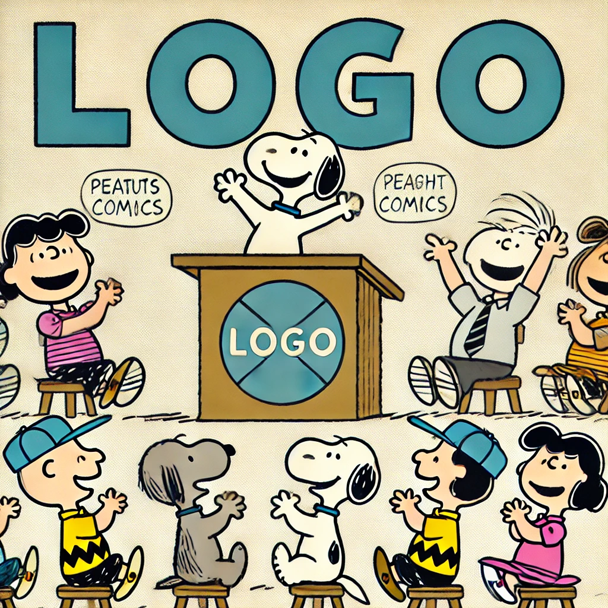

# CS 5500 Fall 2024 Template Repository 

- This is the landing page of your team.
- **Team Name:** [Place holder for a team name]
- **Team Logo:** [Place holder for a team logo]
- **Team Description:** [Place holder for a team description]

## Team Members
| Image | Name | Email |
|-------|------|-------|
|  | Cat | cat@example.com |
|  | Dog | dog@example.com |
|  | Hippo | hippo@example.com |
|  | Shark | shark@example.com |

## Assigned TA
Your TA will be one of these:

| Image | Name | Email |
|-------|------|-------|
|  | Bella | xie.xinyu@northeastern.edu |
|  | Edward | Zhang.jiale2@northeastern.edu |

## Weekly Stand-Up Time
- [Place holder for the assigned time for the weekly stand up with TA]

